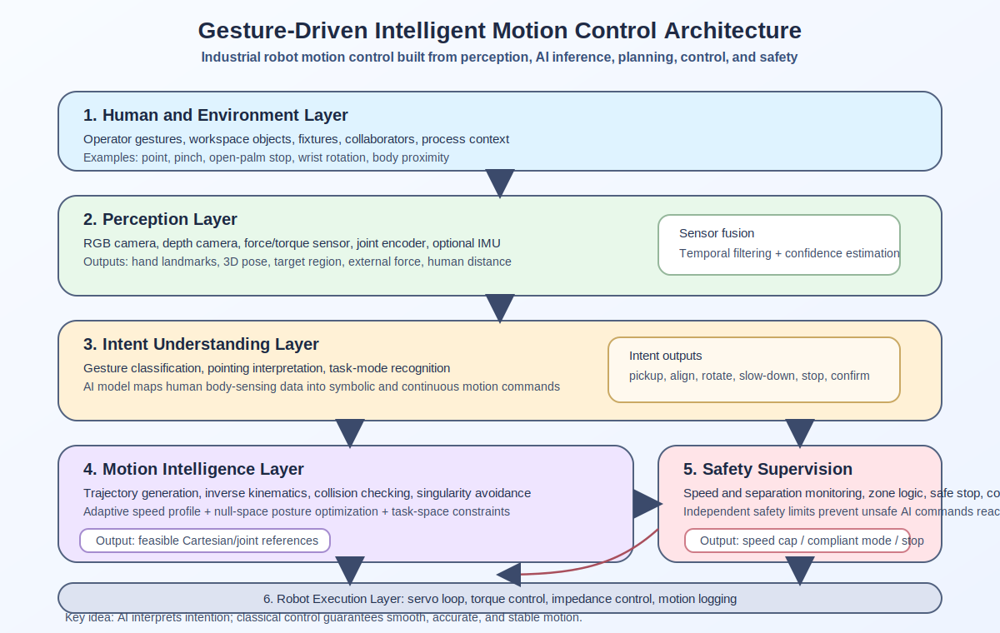
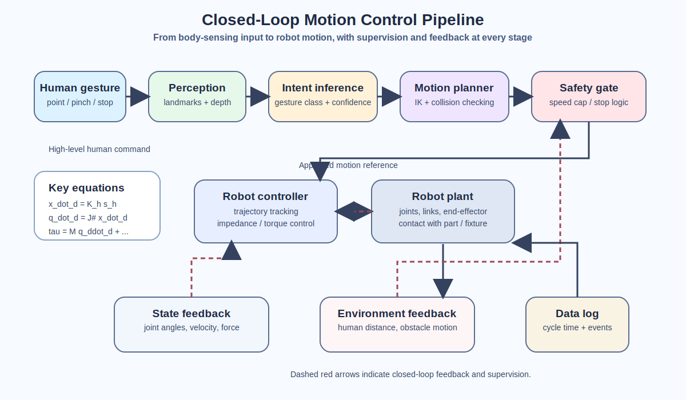
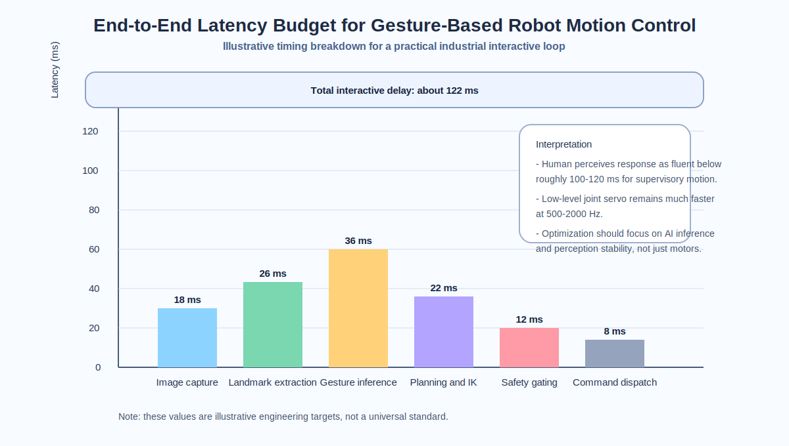
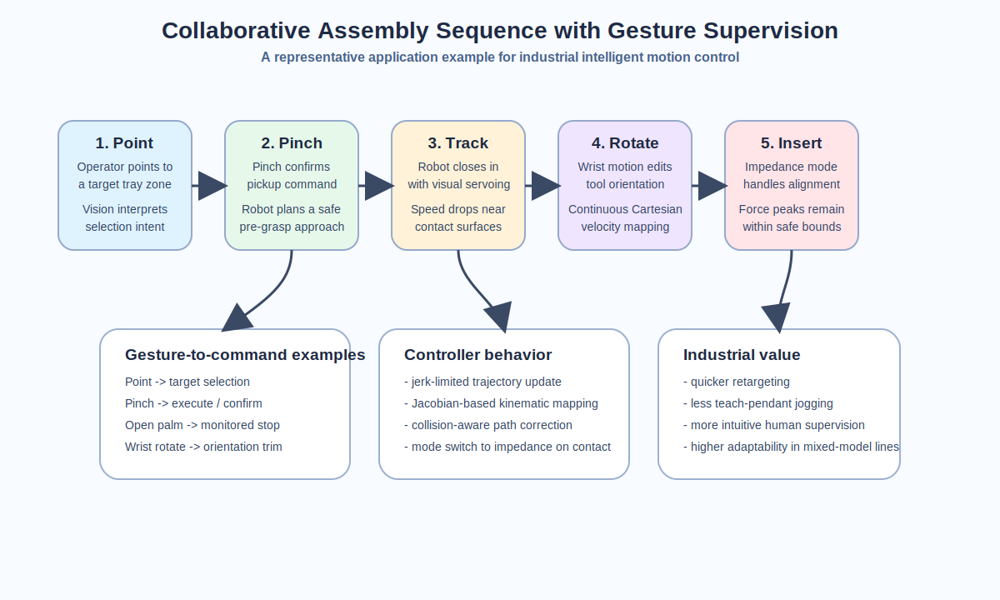
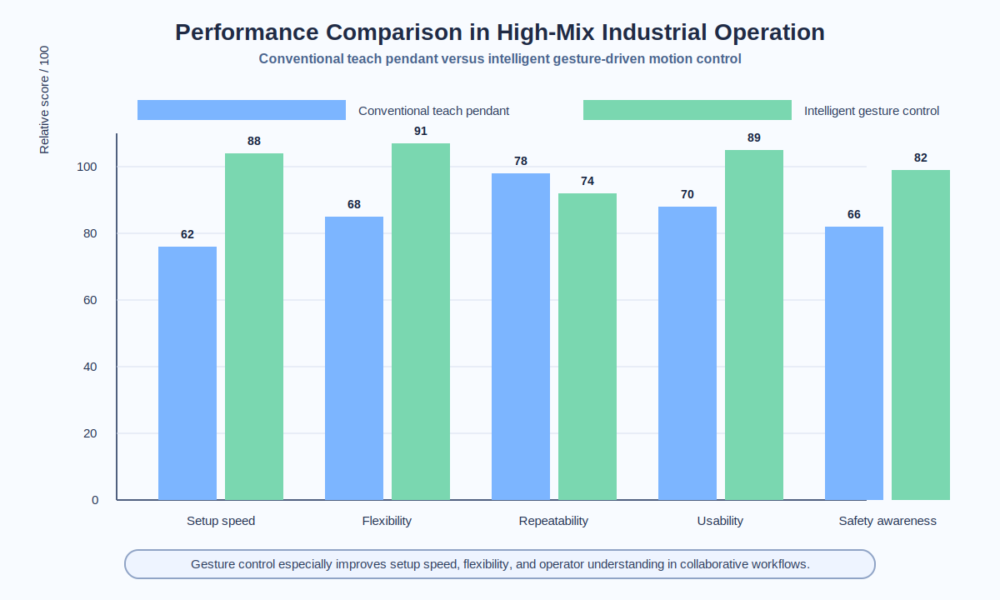
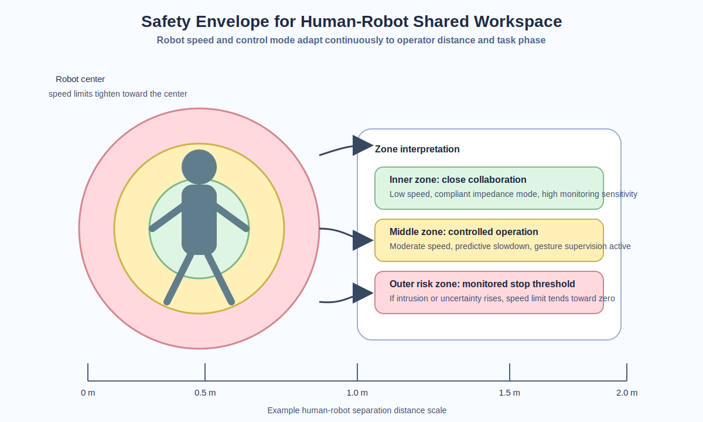

# intelligent Motion Control of Industrial Robot

## 副标题
**面向工业机器人的体感交互式智能运动控制应用示例报告**

> 说明：本文以中文技术报告风格组织内容，并保留必要的英文控制术语与公式表达，便于直接用于课程汇报、作业整理或后续排版成 PDF。

---

## 摘要

本文围绕 **intelligent Motion Control of Industrial Robot** 这一题目，给出一个以**体感控制（gesture / body-sensing control）**为核心的人机协作工业机器人应用示例。报告不把“运动控制”理解为单纯的伺服跟踪问题，而是将其视为一个由**感知、意图识别、运动规划、动力学控制与安全监督**共同构成的智能系统。所选案例为：在协作装配单元中，操作员通过**指向、捏合、张掌停止、手腕旋转**等自然体感动作，对 6 自由度工业机器人进行目标选择、姿态修正、速度调节与安全干预。

从工程角度看，这类系统的价值在于：它既保留了工业机器人高精度、高重复性的优势，又通过视觉感知和智能控制提升了系统在**高混合、小批量、频繁换型**生产中的灵活性。报告中进一步讨论了手势识别、雅可比映射、阻抗控制、时延预算以及安全包络等关键技术，使该应用示例既具有技术深度，也具备较强的可解释性和展示性。

This report presents an application-oriented study of **intelligent motion control of industrial robots** with a special focus on **gesture-based body-sensing interaction**. The central idea is to replace or complement the conventional teach pendant with a perception-control pipeline that can understand a human operator's hand gestures, estimate motion intent, and convert that intent into safe, smooth, and task-aware robot motion.

Rather than treating motion control as a pure servo problem, the report views it as a **multi-layer intelligent system** that combines sensing, intent inference, trajectory generation, whole-body robot control, and functional safety. A representative industrial example is analyzed: a collaborative assembly cell where a worker uses natural gestures such as **pointing, open-palm stop, pinch confirm, and wrist rotation** to guide a 6-DOF robot during part pickup, alignment, insertion, and inspection.

The result is a motion-control framework that is more intuitive than pendant programming, faster for high-mix low-volume production, and more adaptive in shared workspaces. The report also discusses the control equations, real-time constraints, performance metrics, and safety boundaries that make such systems practical in industrial deployment.

---

## 1. 研究背景与选题意义

Traditional industrial robots are excellent at repeatability, but they are less convenient when:

- product models change frequently,
- operators must intervene during motion execution,
- trajectories need to be adjusted on the fly,
- safety and collaboration are required in a shared workspace.

In these scenarios, **intelligent motion control** becomes more than trajectory tracking. It must answer four questions in real time:

1. **What is the operator trying to do?**
2. **What robot motion is physically feasible?**
3. **How can the robot move smoothly and accurately?**
4. **How can the robot remain safe while sharing space with humans?**

Gesture-driven body-sensing control is a compelling answer because it turns the operator into a high-level supervisor while letting the robot handle low-level dynamics, collision checking, and servo regulation.

---

## 2. 应用示例：基于体感交互的协作装配

### 2.1 场景描述

Consider a collaborative robot deployed in a mixed-model industrial assembly workstation. Parts arrive in small batches, so fixed programming is inefficient. The operator stands beside the robot and uses a depth camera and RGB camera based interface to issue commands:

- **Point at tray** -> robot selects a target part region
- **Pinch** -> confirm pickup or insertion
- **Palm open** -> immediate deceleration / stop
- **Swipe left or right** -> switch task mode
- **Wrist rotation** -> fine orientation adjustment
- **Two-hand spread** -> enlarge safety margin / reduce speed

This interface does not directly command motor torque. Instead, it provides a high-level intention signal that flows into a motion-control stack capable of:

- real-time target estimation,
- inverse kinematics,
- trajectory smoothing,
- impedance/admittance based compliant control,
- safety-speed adaptation,
- contact monitoring during insertion.

### 2.2 系统架构



**Figure 1.** Layered architecture of a gesture-driven intelligent industrial robot controller. The important feature is the coexistence of **AI perception** and **classical control**: perception interprets intent, while the control layer guarantees stability and tracking quality.

---

## 3. 智能运动控制的技术原理

## 3.1 体感感知与动作意图识别

The gesture interface starts with multimodal sensing:

- RGB camera for visual hand appearance
- Depth camera for 3D position estimation
- Optional IMU or wearable tag for redundancy
- Force/torque sensor at the wrist for contact awareness
- Joint encoders for robot state feedback

Hand landmarks can be estimated from a real-time vision pipeline such as MediaPipe-style keypoint tracking. Suppose the detected hand landmarks are:

```text
H = {p1, p2, ..., p21},   pi = [xi, yi, zi]^T
```

From these landmarks, the system extracts:

- finger opening angles,
- palm normal direction,
- pinch distance,
- wrist orientation,
- temporal velocity features.

These features are fed into a gesture classifier or sequence model:

```text
g_t = f_theta(H_t, H_t-1, ..., H_t-k)
```

where `g_t` is the inferred operator command at time `t`, and `f_theta` can be a CNN-LSTM, temporal transformer, or lightweight graph-based model for hand skeleton recognition.

### 为什么这里必须引入“智能”

A simple threshold detector is often not enough in industrial environments because lighting, gloves, occlusion, and background clutter create ambiguity. An intelligent classifier improves:

- robustness to operator differences,
- rejection of accidental gestures,
- confidence estimation for safety-critical commands,
- task-context awareness, such as interpreting the same pointing gesture differently in pickup mode and inspection mode.

---

## 3.2 运动映射：从人体动作意图到机器人控制命令

After gesture recognition, the controller translates intent into a robot motion primitive. There are two common strategies:

### A. 离散运动原语映射

Useful for clear symbolic commands:

- `pinch` -> execute grasp sequence
- `open palm` -> hold / stop
- `swipe` -> switch waypoint set

### B. 连续型体感映射

Useful for fine positioning. A small wrist rotation or hand displacement is mapped to desired Cartesian velocity:

```text
x_dot_d = K_h * s_h
```

where:

- `x_dot_d` is desired end-effector velocity,
- `s_h` is the hand-motion state vector,
- `K_h` is a scaling matrix that adapts operator motion to robot motion.

The desired Cartesian motion is converted to joint velocity using the Jacobian pseudoinverse:

```text
q_dot_d = J(q)^# * x_dot_d + (I - J(q)^# J(q)) * z
```

where the null-space term `z` can be used to avoid joint limits or keep a preferred posture.



**Figure 2.** Closed-loop motion generation process. Gesture information is not sent directly to the actuator. It is filtered through intent estimation, planning, robot kinematics, and safety supervision before reaching the servo layer.

---

## 3.3 面向精确与平滑执行的动力学控制

Once the desired trajectory is generated, the robot still needs a dynamic controller. A standard computed-torque style law is:

```text
tau = M(q) * q_ddot_d + C(q, q_dot) * q_dot + g(q)
      + K_p * (q_d - q) + K_d * (q_dot_d - q_dot)
```

where:

- `M(q)` is the inertia matrix,
- `C(q, q_dot)` represents Coriolis/centrifugal effects,
- `g(q)` is gravity,
- `K_p`, `K_d` are feedback gains.

For contact-rich industrial tasks such as insertion, deburring, or polishing, pure stiff position control is often too rigid. A more intelligent approach is **impedance control**:

```text
M_d * x_ddot + D_d * x_dot + K_d * (x - x_d) = F_ext
```

This lets the end-effector behave like a virtual mass-spring-damper system. The benefits are:

- softer contact with fixtures,
- better tolerance to pose uncertainty,
- safer interaction with human operators,
- reduced damage risk during force-sensitive motion.

In an advanced system, the parameters `(M_d, D_d, K_d)` are adjusted online according to:

- human proximity,
- task phase,
- contact state,
- confidence in gesture interpretation.

That is why the control is called **intelligent**: it adapts its behavior instead of using a single fixed gain set for every situation.

---

## 3.4 实时性约束与时延预算

Industrial motion control is only useful if it is fast enough. A typical latency budget may look like this:



**Figure 3.** Example end-to-end latency decomposition. Practical gesture-driven industrial systems usually need the total response to remain below roughly 100-120 ms for fluent interaction, while low-level servo loops still run at much higher frequency.

Typical loop frequencies:

- Vision perception: 30-60 Hz
- Intent inference: 20-60 Hz
- Motion planner update: 50-200 Hz
- Robot joint servo loop: 500-2000 Hz
- Safety monitor: 100-500 Hz

This multi-rate structure is critical. AI modules do not replace the servo loop; they supervise it.

---

## 4. 典型应用流程

### 4.1 示例任务：装配单元中的精密插装

The robot picks a connector housing from a tray and inserts it into a fixture. The operator supervises the process through gesture control.



**Figure 4.** A practical interaction sequence in a collaborative assembly cell.

### 4.2 分步骤运动行为说明

1. **Target declaration**  
   The operator points toward a tray section. Vision detects the pointing direction and identifies the target bin.

2. **Pickup authorization**  
   A pinch gesture confirms that the target is correct. The robot runs a collision-checked pre-grasp trajectory.

3. **Approach and pickup**  
   The robot switches to a slower speed near the part and uses visual servoing to reduce grasp pose error.

4. **Human-supervised transport**  
   If the operator rotates the wrist, the robot adjusts the end-effector orientation continuously.

5. **Insertion assistance**  
   As contact begins, the controller transitions from stiff position control to impedance control to avoid jamming.

6. **Emergency interruption**  
   An open-palm gesture or intrusion into the safety envelope immediately reduces speed or stops motion.

7. **Cycle completion and logging**  
   The robot stores task data including cycle time, pose correction, force peaks, and safety events for future optimization.

This workflow shows that modern motion control is no longer just "move from A to B". It includes perception, supervision, adaptive compliance, and safety-aware execution.

---

## 5. 性能对比与工程价值

To show the engineering value of intelligent motion control, compare it with a conventional teach-pendant workflow for high-mix production.



**Figure 5.** The intelligent gesture-driven setup generally improves setup efficiency and flexibility, even if absolute repeatability is still dominated by the robot's mechanical structure and servo quality.

### 代表性结论

- **Programming effort decreases** because natural gestures replace repeated manual jogging.
- **Operator training becomes easier** for non-expert users.
- **Response to product variation improves** because the system adapts target positions and motion modes online.
- **Safety perception improves** because the robot behavior becomes more interpretable to nearby workers.

### 一个必须说明的工程现实

Gesture interfaces are not magic. They are ideal for:

- task selection,
- waypoint teaching,
- local correction,
- speed and orientation adjustment,
- collaborative supervision.

They are less suitable for:

- high-bandwidth direct joint teleoperation over long periods,
- micron-level metrology tasks,
- environments with severe visual occlusion and poor lighting unless sensor fusion is used.

---

## 6. 安全设计与工业可行性

Gesture-controlled robots must be **more** safe than conventional systems, not less. Therefore, a safety layer is mandatory.



**Figure 6.** A safety envelope couples human distance, robot speed, and control mode. As the operator gets closer, the controller gradually reduces allowable speed and may switch to compliant or monitored stop mode.

### 常见安全机制

1. **Speed and separation monitoring**  
   Robot speed is reduced as human distance decreases.

2. **Power and force limiting**  
   Contact force is bounded through compliant control and mechanical design.

3. **Safe stop by explicit gesture**  
   A high-confidence open-palm gesture can serve as a user-level stop request.

4. **Confidence-aware command acceptance**  
   Low-confidence gestures should be ignored or require confirmation.

5. **Workspace zoning**  
   Forbidden, collaborative, and free-speed zones can be defined around fixtures and operators.

6. **Redundant supervision**  
   Vision, force sensing, and robot internal diagnostics cross-check one another.

### 一个重要的工程原则

The gesture recognizer should **never** be treated as the only safety mechanism. Certified safety functions must remain independent from the AI layer whenever required by regulations and industrial best practice.

---

## 7. 值得延展的高级技术方向

To make the system even more intelligent, several advanced methods can be added:

### 7.1 基于学习的阻抗参数整定

Reinforcement learning or adaptive optimization can tune compliance parameters during assembly. For example:

- higher damping during uncertain contact,
- lower stiffness when humans are close,
- stronger tracking when the path is clear.

### 7.2 数字孪生辅助运动验证

A digital twin can simulate the planned trajectory before execution and check:

- singularity risk,
- collision probability,
- cycle-time prediction,
- fixture accessibility.

### 7.3 多模态意图融合

The most reliable systems combine:

- gesture,
- gaze direction,
- speech keywords,
- force interaction,
- process state.

This avoids overloading a single modality and makes the interface more natural.

### 7.4 数据驱动的生产优化

Every gesture-guided intervention can be logged. Over time, the system can learn:

- which trajectories need frequent correction,
- which gestures are often confused,
- where cycle delays occur,
- how to redesign robot motions for smoother collaboration.

This turns motion control into a continuously improving intelligent manufacturing asset.

---

## 8. 关键挑战

Despite its promise, intelligent gesture-based motion control still faces real industrial challenges:

- occlusion from tools, bins, and other workers,
- varying lighting and reflective metal surfaces,
- operator diversity in gesture style,
- latency spikes from heavy vision models,
- cybersecurity and data governance for camera systems,
- validation difficulty for AI components in safety-relevant applications.

Therefore, successful deployment requires careful co-design of:

- hardware sensing,
- AI models,
- classical control,
- safety engineering,
- human factors.

---

## 9. 结论

**intelligent Motion Control of Industrial Robot** is best understood as the fusion of **AI perception**, **real-time motion planning**, **robot dynamics**, and **functional safety**. In the application example studied here, gesture-based body-sensing control allows an operator to guide a robot in a more intuitive and flexible way than traditional programming alone.

The key technical insight is that intelligent motion control is not simply about recognizing gestures. It is about transforming human intention into robot motion through a disciplined hierarchy:

**perception -> intent inference -> motion generation -> dynamic control -> safety supervision**.

When these layers are well integrated, industrial robots become:

- easier to command,
- safer to share space with,
- more adaptive to product change,
- more useful in high-mix collaborative manufacturing.

In short, gesture-driven motion control is not just an interesting interface. It is a meaningful step toward **human-centered intelligent automation**.

---

## 图示索引

- Figure 1: System architecture
- Figure 2: Motion-control pipeline
- Figure 3: Real-time latency budget
- Figure 4: Collaborative task sequence
- Figure 5: Performance comparison
- Figure 6: Safety envelope and speed adaptation

---

## 参考

[1] Siciliano, B., and Khatib, O. (Eds.). *Springer Handbook of Robotics*. Springer, 2016.

[2] Ajoudani, A., Zanchettin, A. M., Ivaldi, S., Albu-Schaffer, A., Kosuge, K., and Khatib, O. "Progress and prospects of the human-robot collaboration." *Autonomous Robots*, 42, 957-975, 2018.

[3] Khatib, O. "A unified approach for motion and force control of robot manipulators: The operational space formulation." *IEEE Journal on Robotics and Automation*, 3(1), 43-53, 1987.

[4] Lugaresi, C., Tang, J., Nash, H., et al. "MediaPipe: A Framework for Building Perception Pipelines." arXiv:1906.08172, 2019.

[5] Zhang, F., Bazarevsky, V., Vakunov, A., Tkachenka, A., Sung, G., Chang, C.-L., and Grundmann, M. "MediaPipe Hands: On-device Real-time Hand Tracking." arXiv:2006.10214, 2020.

[6] Vysocky, A., Semjon, J., Pitel, J., and collaborators. "Hand Gesture Interface for Robot Path Definition in Collaborative Applications: Implementation and Comparative Study." 2023.

[7] Zhao, X., et al. "Human-Robot Collaboration Framework Based on Impedance Control in Robotic Assembly." *Engineering*, 2023/2024.

[8] ISO/TS 15066:2016. *Robots and robotic devices - Collaborative robots*.

[9] Cai, Z., et al. "Model-based reinforcement learning variable impedance control for human-robot collaboration." *Journal of Intelligent and Robotic Systems*, 2022.

[10] Castro, A., et al. "Trends of human-robot collaboration in industry contexts: Handover, learning, and metrics." *Sensors*, 21(12), 4113, 2021.
